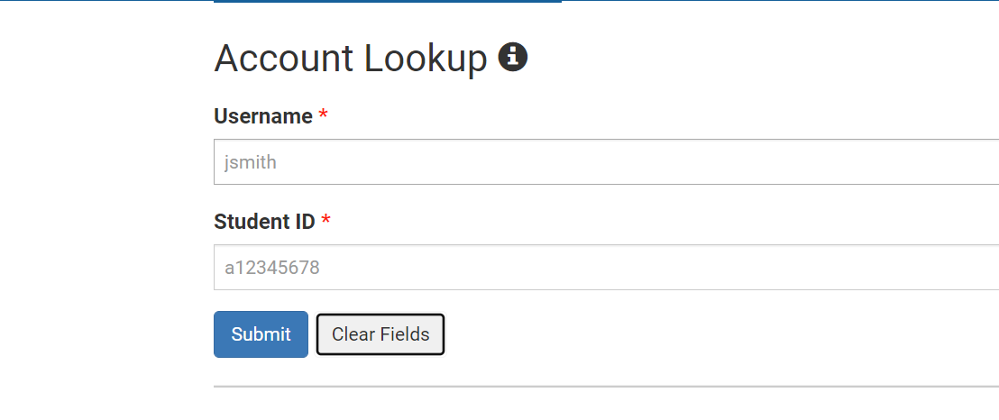
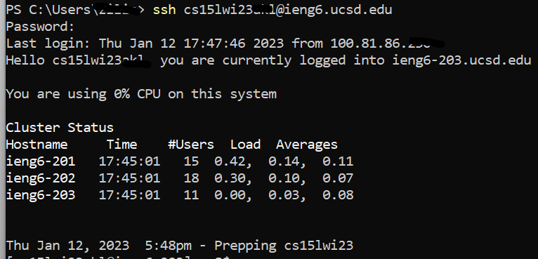

# Lab Report 1

Created: January 11, 2023 12:18 PM
Lecture: https://ucsd-cse15l-w23.github.io/week/week1/#part-5--run-some-commands
Tags: lab report

Lab Report 1

A17691286

zilin liu

# Setup for CSE 15L, windows

# Environment

1. install Git (it is useful but not required in this lab)

[Git](https://git-scm.com/)

1. VS Code or other text/markdown editor

[Visual Studio Code - Code Editing. Redefined](https://code.visualstudio.com/)

## Find your CSE 15L course account

You can find your CSE 15L account here: 

[Account Lookup](https://sdacs.ucsd.edu/~icc/index.php)

In that page, enter your username (the prefix of your email address, before `@`), and your student ID

After login, you can find your account shown here: 

### Forgot password?

- if you know your SSO password, don’t reset it
    - it will change all your existing passwords
- if you forgot your password, you may reset it follow the instructions on this page
- go to IT desk if you need additional help (they are very helpful)

[[TUTORIAL] How to Reset your Password](https://docs.google.com/document/d/1hs7CyQeh-MdUfM9uv99i8tqfneos6Y8bDU0uhn1wqho/edit)

# Connect to a Remote Server

1. open windows PowerShell (you can type `window powershell` in computer search bar and open it)
2. enter this command:`ssh <*the course specific account name>*[@ieng6.ucsd.edu](mailto:cs15lwi23akl@ieng6.ucsd.edu)`
- your terminal should look like this: `PS C:\Users\ <*your user name>*> ssh <*the course specific account name>*[@ieng6.ucsd.edu](mailto:cs15lwi23akl@ieng6.ucsd.edu)`
1. enter your course specific password (or your SSO password, by default)

<aside>
💡 The terminal will not display the password you entered. **DONT paste your password use `control + v`, it will input ^V, not your clipboard. Use right click instead**

</aside>

if you login successfully, your terminal should look like that: 

# Run some remote commands:

try to run some remote commands like these:

> `cd ~`
> 

> `cd`
> 

> `ls -lat`
> 

> `ls -a`
> 

> `ls <directory>` where `<directory>` is `/home/linux/ieng6/cs15lwi23/cs15lwi23abc`, where the `abc` is one of the other group members’ username
> 

> `cp /home/linux/ieng6/cs15lwi23/public/hello.txt ~/`
> 

> `cat /home/linux/ieng6/cs15lwi23/public/hello.txt`
> 

### example: run ls -lat:

your terminal should look like this:

### logout

you may use key combination `ctrl+D` or runtime command `exit` to logout 

# Create Git Repository

1. first create your account here:

[GitHub: Let's build from here](https://github.com/)

1. create a new repository, and name it `cse15l-lab-reports`

## Make website

- render website with markdown language

[Week 1 lab report](https://kiminus.github.io/cse15l-lab-reports/lab-report-week1)